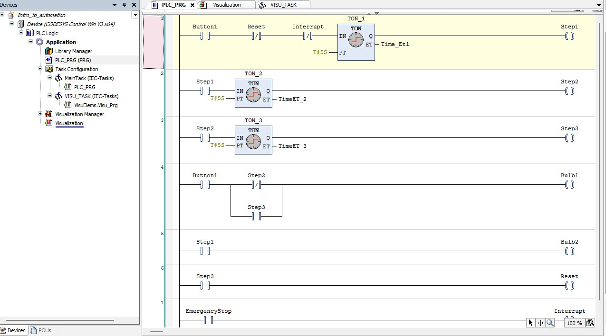
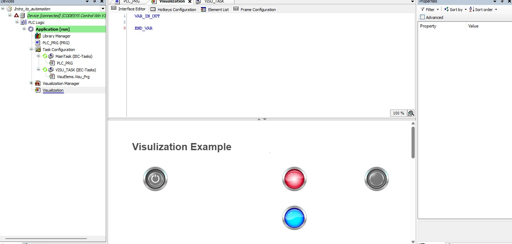

# Automation Labs (CODESYS)

This repository contains my PLC automation labs built using CODESYS.  
Each lab includes the actual project file and visuals showing the ladder logic and the simulation.

---

## 🔹 Lab 01 – Intro to Automation

This lab covers:
- Creating BOOL variables
- Building a simple TON timer sequence (TON1 → TON2 → TON3)
- Turning lamps on/off using Step1, Step2, Step3 logic
- Using a visualization with a button and indicator lamps

### ✔ Ladder Logic

### ✔ Visualization

### ✔ Project File
`Intro_to_automation.project`

---

## 🛠 Tools Used
- CODESYS 3.5
- Ladder Logic (LD)
- TON Timers
- Visualization Editor
- Windows VM on macOS (UTM)

---

## 🎯 Purpose
To document my learning progress in automation and build a portfolio of real PLC labs.

---

More labs coming soon.
